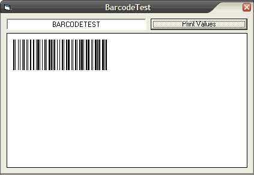

## Barcode Code128 Generator without using fonts

### Description

A barcode generator. Right now only accepts a subset of Code128B (A-Z &amp; 0-9) but can print all that is required by the Code128 check character.

Output is verified correct using my Argox barcode scanner.

If you want to test it, do a print screen and paste the generated barcode into MS Word. Then print using Word's "High Quality" print setting

Doesn't use any barcode fonts, just the Line statement.
 
### More Info
 

             |
---                |---
**Submitted On**   |2007-05-10 04:40:02
**By**             |[AlanMN](https://github.com/Planet-Source-Code/PSCIndex/blob/master/ByAuthor/alanmn.md)
**Level**          |Beginner
**User Rating**    |4.8 (29 globes from 6 users)
**Compatibility**  |VB 6\.0
**Category**       |[Graphics](https://github.com/Planet-Source-Code/PSCIndex/blob/master/ByCategory/graphics__1-46.md)
**World**          |[Visual Basic](https://github.com/Planet-Source-Code/PSCIndex/blob/master/ByWorld/visual-basic.md)
**Archive File**   |[Barcode\_Co2064895102007\.zip](https://github.com/Planet-Source-Code/alanmn-barcode-code128-generator-without-using-fonts__1-68554/archive/master.zip)

